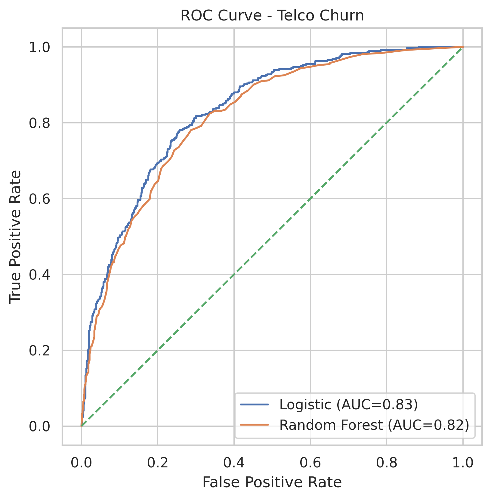
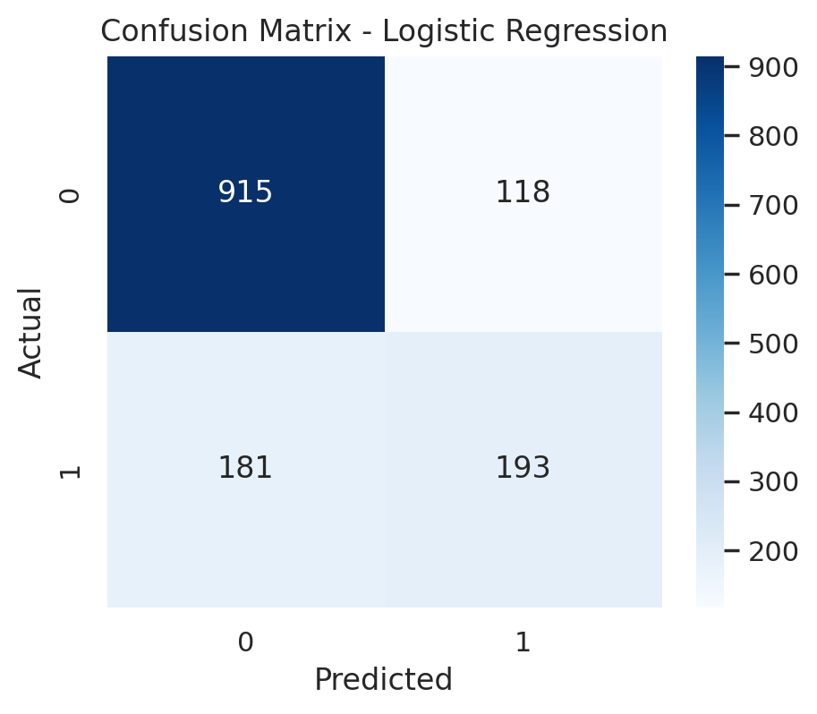

# Telco Customer Churn Prediction

## Project Summary

This project develops a customer churn prediction model for a telecommunications company.  
The objective is to identify high-risk customers and support data-driven retention strategies.

**Best Performing Model:** Logistic Regression  
**Test AUC:** 0.8319  
**Cross-Validation AUC:** 0.8452  

Logistic Regression demonstrated stronger generalization and more stable performance across validation folds.

## Business Problem

Customer churn represents significant revenue loss for telecom providers.  
Acquiring new customers is typically more expensive than retaining existing ones.

The goal of this project is to:

- Predict which customers are likely to churn  
- Improve early detection of at-risk customers  
- Support targeted retention campaigns  
- Reduce revenue leakage  

## Dataset Overview

- 7,043 customers  
- 21 features  
- Binary classification problem (Churn: Yes/No)  
- Imbalanced dataset (~26% churn rate)  

Key variables include:

- Contract type  
- Monthly charges  
- Tenure  
- Payment method  
- Internet services  

## Data Preparation

- Cleaned missing values in `TotalCharges`
- Converted categorical variables using one-hot encoding
- Train/test split (80/20)
- Standardized features for Logistic Regression using a Pipeline

## Models Implemented

### Logistic Regression (with StandardScaler Pipeline)

- Baseline linear classification model  
- Interpretable and stable  
- Best generalization performance  

### Random Forest Classifier

- Non-linear ensemble model  
- Used for performance comparison  
- Slightly lower cross-validation stability  

## Model Performance

| Model | Test AUC | CV AUC | Accuracy |
|-------|----------|--------|----------|
| Logistic Regression | 0.8319 | 0.8452 | 0.7875 |
| Random Forest | 0.8160 | 0.8232 | 0.7854 |

Logistic Regression achieved better AUC and stronger cross-validation consistency.

## ROC Curve

The ROC curve shows strong discriminatory power for both models, with Logistic Regression performing slightly better overall.

## Confusion Matrix Analysis (Logistic Regression)

### Baseline Model (Threshold = 0.5)

Results:

- True Positives: 193  
- False Negatives: 181  
- False Positives: 118  
- True Negatives: 915  

Recall ≈ 51.6%

The baseline model misses a substantial number of churn customers.

### Optimized Threshold Model

Results:

- True Positives: 296  
- False Negatives: 78  
- False Positives: 300  
- True Negatives: 733  

Recall ≈ 79.1%

After threshold tuning, recall improved significantly, allowing better identification of at-risk customers.

## Business Trade-off Analysis

Increasing recall reduces revenue leakage by identifying more churn customers.  
However, it increases false positives, which raises retention campaign costs.

This represents a strategic trade-off:

- Higher recall → More churn customers detected → Lower revenue loss  
- Higher precision → Lower campaign cost  

Optimal threshold selection should depend on:

- Customer lifetime value  
- Retention campaign cost  
- Marketing budget constraints  

## Key Insights

- Month-to-month contracts show the highest churn risk  
- Higher monthly charges are associated with higher churn probability  
- Early-tenure customers are significantly more likely to churn  

## Business Recommendations

- Target retention campaigns toward month-to-month customers  
- Offer incentives for long-term contract conversion  
- Focus early engagement programs within the first 6 months  
- Implement threshold-based targeting depending on marketing budget  

## Tech Stack

Python  
Pandas  
NumPy  
Scikit-learn  
Matplotlib  
Seaborn  
